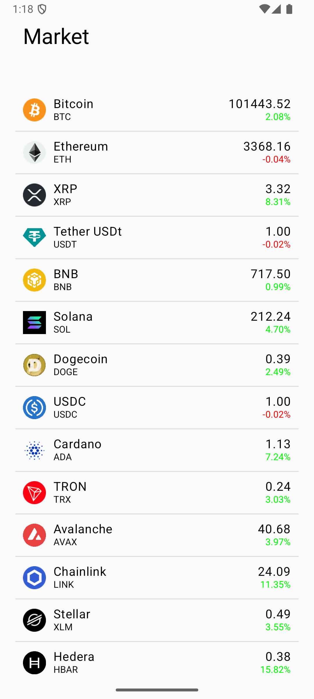

# Cryptocurrency Price Tracker App

## Overview

This is an Android application built with **Kotlin** that allows users to view a list of popular cryptocurrencies, displaying real-time price updates, percentage changes, and other important information. The data is fetched from the **CoinMarketCap API** and is dynamically updated based on percentage changes.

The app follows modern Android development practices using **Jetpack Compose**, **MVVM architecture**, **Retrofit**, and **Coroutines** to deliver a smooth, responsive, and efficient experience. 

The goal of the app is to present cryptocurrency data in an intuitive way while ensuring high performance, with plans for additional memory optimizations and a seamless data display in future updates.

## Features

- **Live Cryptocurrency Data:** View a list of cryptocurrencies with real-time prices and 24-hour percentage changes.
- **Dynamic Updates:** The list automatically updates based on significant changes in cryptocurrency prices.
- **API Integration:** Data is fetched asynchronously from the [CoinMarketCap API](https://coinmarketcap.com/api/), using **Retrofit** for API calls.
- **Jetpack Compose UI:** The app uses **Jetpack Compose** for building UI components in a declarative, reactive style.
- **MVVM Architecture:** The application follows the **Model-View-ViewModel** architecture to separate concerns and facilitate testing.
- **Coroutines for Async Operations:** Asynchronous tasks such as fetching data and performing background operations are handled by **Kotlin Coroutines**.

## Tech Stack

- **Kotlin**: The programming language for building the Android app.
- **Jetpack Compose**: For building modern and responsive UI components.
- **MVVM Architecture**: Ensures clean architecture with separation of concerns.
- **Retrofit**: Used for network requests to fetch cryptocurrency data from the CoinMarketCap API.
- **Coroutines**: Handles asynchronous operations like network calls efficiently without blocking the main thread.
- **LiveData**: Used to observe data and update the UI reactively.
- **Room (Future Feature)**: Potential integration of **Room** database for offline storage and improved data handling.

## Future Enhancements

- **Seamless Data Display:** I am working on improving the way the data is presented, making it smoother and more responsive as the data changes.
- **Memory Optimization:** Future updates will include techniques for optimizing memory usage, especially when dealing with large amounts of dynamic data.

## Setup & Installation

1. **Clone the repository:**
   ```bash
   git clone https://github.com/your-username/crypto-price-tracker.git



